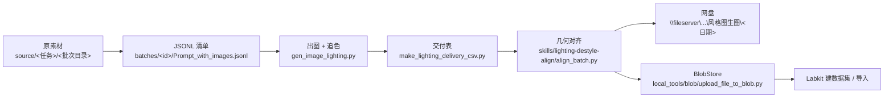
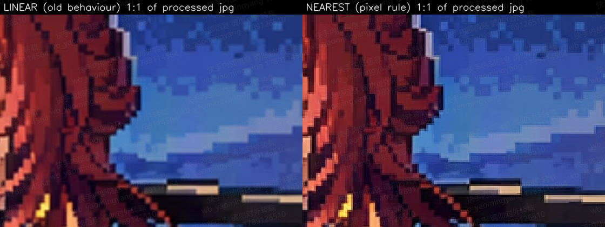
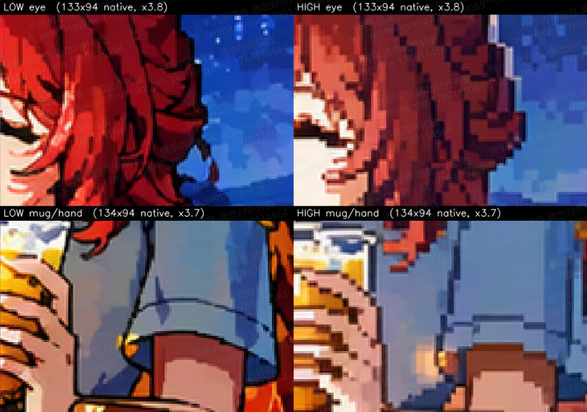

# batch-image-pipeline — 图生图批量跑图流水线（光影光效 / 风格化）

用 gpt-image-2（`images/edits`）对一批原图做**光影改写**或**风格转换**（如 二次元平涂 → 像素），
再经过 追色 → 交付表 → 几何对齐 → 网盘 / BlobStore 交付，最终送 Labkit 标注。

仓库根目录 **就是开发机 `/mnt/kfs/alice/pipeline/` 的布局**：clone 到开发机后脚本可以直接跑
（脚本按自身位置找 `batches/index.json`、`prompts.json`、`skills/`）。`local_tools/` 是本机 Windows 侧的
配套工具，`docs/`、`examples/`、`runbooks/` 是文档和实跑记录，放在开发机上无副作用。

---

## 1. 全局流程



| 步 | 做什么 | 脚本 | 产物（开发机） |
|---|---|---|---|
| 0 | 素材入库、登记批次 | 手工 + `config_template.json` | `source/…`、`batches/<id>/config.json`、`batches/index.json` |
| 1 | 生成任务清单（一行 = 一张图的一轮） | `build_jsonl_lighting.py`（光影）/ 风格批次见 §4.2 | `batches/<id>/Prompt_with_images.jsonl` |
| 2 | 调 gpt-image-2 出图，同时产出 plain 与 `_colormatched` 两版 | `gen_image_lighting.py --batch <id>` | `work/<id>/<批次目录>-qt-round1/`、`work/<id>/Prompt_with_images_<id>.csv` |
| 3 | 建 7 列交付表，按标签决定用 plain 还是追色版 | `make_lighting_delivery_csv.py --batch <id> [--no-colormatch-tags all] --verify` | `batches/<id>/<id>_<任务>_final.csv` + `_report.txt` + `_verify.txt` |
| 4 | 按目标风格选对齐规则（放大插值、特征域，见 §5.2），ORB + 相似变换把 AI 图对齐回原图空间，导出 input/output 对 | `skills/lighting-destyle-align/align_batch.py` | `work/<id>/<交付表名>_align_out/`（`processed/`、`align_all_results.csv`、`review/`） |
| 5 | 复制到网盘（沿用 `<日期>/<批次目录>/` 五项结构） | `local_tools/kml/kml_fetch.py` + `deliver_to_share.py` | `\\fileserver\share\alice\风格图生图\<MMDD>\<批次目录>\` |
| 6 | 上传 BlobStore、Labkit 建集 | `local_tools/blob/upload_file_to_blob.py`、`blob-upload-dashboard/` | `bucket-a/label_data/<日期_任务>_labkit/<子集>/…` |

两类任务的差别只在 **prompt 来源** 和 **追色 / 对齐规则**——后者按目标风格逐一制定（完整表见 §5.2）：

| | 光影光效 | 风格化（像素 / 白描 / 新海诚 / 莫奈 / 水墨 …） |
|---|---|---|
| prompt | `prompts.json`（由 光照种类-提示词总表 导出，按光效标签取） | `prompts/风格种类-提示词总表.xlsx`（按 `aigc生成风格` 取，进度=通过）或单独的 prompt txt |
| 追色 | 按 `skills/lighting-delivery-csv/defaults.json` 的 `no_colormatch_tags` 决定 | 按风格：自带色板的（像素、水墨）关闭 `colormatch_enabled=false`；要沿用原图时段色相的（莫奈）用追色版；新海诚按 A/B 定 |
| 对齐放大 | 双线性（默认） | 按风格：像素 **最近邻**、白描 **双三次 + 边缘匹配**、新海诚等细线平涂 **双三次**（`--upscale-interp cubic`）、其余双线性 |
| 轮次 | 3（`-r1/-r2/-r3`） | 1 或 3，按需求 |

---

## 2. 目录结构

```text
batch-image-pipeline/                    ← == 开发机 /mnt/kfs/alice/pipeline/
├── README.md                            ← 本文档
├── gen_image_lighting.py                ← 步骤 2：出图 + 追色（quality/追色开关/模型部署/后端 gateway|klink 都按批次 config 读；key 见 secrets.example.json）
├── make_lighting_delivery_csv.py        ← 步骤 3：建交付表（调 skills/lighting-delivery-csv）
├── build_jsonl_lighting.py              ← 步骤 1（光影）：按目录/标签生成 JSONL
├── filter_dup_jsonl.py                  ← 出图前按跳过清单剔除重复图任务
├── config_template.json                 ← 新批次 config 模板 + 目录约定 + 标准命令
├── prompts.json                         ← 光影 prompt 表（标签 → [{effect, prompt}]）
├── secrets.example.json                 ← 出图 API key 的放置方式（secrets.json 不入库）
├── batches/
│   ├── index.json                       ← 所有批次登记（值 = 该批次 config.json 全文）
│   ├── style0911/config.json            ← 二次元平涂→像素，low，3 轮（测试批）
│   └── style0914/                       ← 二次元平涂→像素，high，1 轮（正式批）
│       ├── config.json                  ← 含 image_quality / runs 字段
│       ├── Prompt_with_images.jsonl     ← 61 行任务清单
│       └── Prompt_with_images_report.txt
├── skills/
│   ├── lighting-batch-jsonl/            ← 素材普查、转 PNG、组 JSONL、校验（defaults.json + scripts/）
│   ├── lighting-delivery-csv/           ← 交付表构建 / 编辑 / 校验；no_colormatch_tags 规则（SKILL.md、reference.md）
│   ├── lighting-delivery-pipeline/      ← 两步交付流水线说明
│   └── lighting-destyle-align/          ← 几何对齐：align_batch.py / align_core.py / defaults.json（像素风、白描规则；--upscale-interp 全局覆盖）/ review 页
├── runbooks/                            ← 实跑用过的脚本，照抄改值即可复用
│   ├── batch_style0914/                 ← 建批次(含 gen 脚本 quality 补丁) → 等出图→交付→对齐→清单 → 审核拦截重试
│   ├── ab_quality_high_vs_low/          ← quality low/high 单图 A/B（建 1 行测试批 + 指标 + 拼图）
│   └── pixel_rule_regress/              ← 像素放大规则的补丁脚本、单测、开发机回归脚本
├── local_tools/                         ← 本机 Windows 侧
│   ├── kml/                             ← 驱动调试 Chrome 里的 code-server：跑命令、上传、下载、截图
│   ├── blob/                            ← BlobStore 上传/下载 + blob-upload-dashboard skill
│   ├── dedup/                           ← 跨批次查重、生成跳过清单（+ data/4档重复清单.csv）
│   ├── prompts/filter_pass.py           ← 从网盘光照总表刷新“通过清单”
│   ├── legacy/                          ← 最早的单机脚本：build_jsonl_from_images_v2.py、gen_image_from_csv.py 等
│   └── requirements.txt
├── prompts/                             ← 风格种类-提示词总表.xlsx、光照通过清单.csv、风格数据交付模板.csv
├── docs/                                ← 早期光影工作流总纲、实操步骤、实测记录、小白教程；images/ 为 A/B 对比图
└── examples/                            ← style0914 的 report/verify/对齐明细/布局/blob 清单，hqtest 的 A/B 指标，本机 JSONL 阶段报告
```

开发机上不入库、但流程依赖的目录：

```text
/mnt/kfs/alice/
├── pipeline/            ← 本仓库
│   └── logs/<id>/       ← 每批次 gen/deliver/align 日志（.gitignore）
├── source/<任务类型>/<批次目录>/   ← 原素材，只读，不往里写任何生成物
└── work/<id>/           ← 出图目录、pipeline CSV/JSONL、原素材软链、*_align_out；删一批 = 删这一个目录
```

---

## 3. 环境

### 3.1 开发机（KML，code-server 网页版 VS Code）

| 项 | 值 |
|---|---|
| 入口 | `https://devbox.example.com/?folder=/mnt/kfs/alice`（SSO） |
| 系统 `python3` | 3.6.8 —— 只能跑清单/交付表；`gen_image_lighting.py` 收尾会报 `shutdown(... cancel_futures)`（无害） |
| **推荐解释器** | `/root/miniconda3/envs/comfyui-v4.0/bin/python`（3.10 + cv2 4.11 + requests/PIL/tqdm/numpy），出图、对齐、交付都用它 |
| 存储 | `/mnt/kfs` 是 KFS（Ceph）。对陌生大目录 `find/du/ls -R` 前先 `getfattr -n ceph.dir.rfiles <目录>`，超过 100 万文件必须先确认 |
| 出图 API | `llm-gateway.example.internal` → Azure `gpt-image-2`（swedencentral），`images/edits`，并发 5、限速约 8 次/分 |
| 依赖 | 对齐环境在开发机本地盘，不在 KFS；开发机重建后 `pip install -r skills/lighting-destyle-align/requirements-batch.txt` |

出图 key：`cp secrets.example.json secrets.json` 填 `api_key`，或 `export GATEWAY_API_KEY=...`。缺 key 时脚本直接退出并提示。

### 3.2 本机（Windows）

1. `pip install -r local_tools/requirements.txt`
2. 启动调试 Chrome（先全部关闭 Chrome）：
   ```powershell
   Start-Process "C:\Program Files\Google\Chrome\Application\chrome.exe" -ArgumentList `
     '--remote-debugging-port=9222', "--user-data-dir=$env:USERPROFILE\chrome-kling-debug", `
     'https://devbox.example.com/?folder=/mnt/kfs/alice'
   ```
3. 手工完成 SSO，页面里 **Ctrl+`** 打开终端。之后 `local_tools/kml/*` 才能工作。
4. 网盘 `\\fileserver\share\alice\风格图生图\` 需本机已有访问权限（资源管理器能打开即可）。

---

## 4. 新批次运行手册

### 4.1 登记批次

```bash
cd /mnt/kfs/alice/pipeline
mkdir -p batches/<id> logs/<id>
cp config_template.json batches/<id>/config.json   # 替换所有 <...>；字段说明在模板 _说明
```

关键字段：

| 字段 | 含义 |
|---|---|
| `image_root` / `kml_image_root` | 原素材根 `/mnt/kfs/alice/source/<任务类型>/<批次目录>` |
| `source_dir` / `delivery_root` | `<批次目录>` 名，交付表相对路径的第一段；交付步骤会在 work_dir 建同名软链指向 image_root |
| `output_rel_prefix` | `<批次目录>-qt-round1`，必须以 `-qt-round1` 结尾（交付表靠它识别出图目录） |
| `work_dir` | `/mnt/kfs/alice/work/<id>` |
| `jsonl` / `pipeline_csv` / `delivery_csv` | `batches/<id>/Prompt_with_images.jsonl` / `Prompt_with_images_<id>.csv` / `batches/<id>/<id>_<任务>_final.csv` |
| **`image_quality`** | `low`（默认）/ `medium` / `high` / `auto`。非 low 时读超时自动 90s → 600s（high 单张实测 130s+） |
| `colormatch_enabled` | `true`（默认，plain + `_colormatched` 都写）/ `false`：出图只写直出 `{id}.png`，CSV 的 `color_ref_path` 留空。水墨、像素这类自带色板、明确不追色的风格用 `false`，省得事后清理追色副产物 |
| `model_id` / `deployment_base_url` | 覆盖出图部署：`model_id` 为 gateway 网关上的 deployment 名（缺省 `<gpt-image-2-deployment>`），或直接给完整的 `.../deployments/<name>/images` 前缀 |
| `api_backend` | `gateway`（默认，Azure 部署路径 + `x-ks-*` 头）/ `klink`：走 KLink 的 OpenAI 兼容 `/v1/images/edits|generations`，`model_id` 即模型名（如 `gpt-image-2.5`），Key 读环境变量 `KLINK_API_KEY` 或 `secrets.json` 的 `klink_api_key` |
| `runs` | 备注用；实际轮次由 JSONL 行数决定 |

把 config 全文同时写进 `batches/index.json` 的同名键（`runbooks/batch_style0914/setup_style0914.py` 里有现成写法）。

### 4.2 生成 JSONL

- 光影批次：`python3 -u build_jsonl_lighting.py --batch <id> --runs 3`，然后必做去重
  `python3 filter_dup_jsonl.py batches/<id>/Prompt_with_images.jsonl batches/<id>/Prompt_with_images.dedup.jsonl`。
- 风格批次：`build_jsonl_lighting.py` 是按光影目录结构和 `prompts.json` 走的，不适用。做法是本机先用
  `local_tools/legacy/build_jsonl_from_images_v2.py`（或 `skills/lighting-batch-jsonl/scripts/build_jsonl.py`）
  从 `prompts/风格种类-提示词总表.xlsx` 取目标风格 prompt 生成 7 字段 JSONL
  （`id, image_path, prompt, light_type, prompt_kind, prompt_target, run`，`id = <文件名>-r<轮>`，`image_path` 用开发机绝对路径），
  上传到 `batches/<id>/`。同素材换轮次时直接过滤上一批 JSONL 的 `run==1` 行即可（style0914 就是这样来的，见 runbooks）。

JSONL 一行示例：

```json
{"id": "二次元平涂-4-横屏-1-r1", "image_path": "/mnt/kfs/alice/source/风格/20260904-.../4分-2072张/二次元平涂-61张/二次元平涂-4-横屏-1.png",
 "prompt": "以输入原图为唯一底图和最高优先级参考，只做像素画法置换……", "light_type": "二次元平涂", "prompt_kind": "布光", "prompt_target": "像素", "run": 1}
```

### 4.3 出图 → 交付表 → 对齐（开发机）

```bash
PY=/root/miniconda3/envs/comfyui-v4.0/bin/python
cd /mnt/kfs/alice/pipeline

# 出图 + 追色（挂后台；已有图自动 skipped_exists，断了重跑同命令续跑）
nohup $PY -u gen_image_lighting.py --batch <id> > logs/<id>/gen.log 2>&1 &

# 交付表 + 校验（风格批次加 --no-colormatch-tags all；1 轮批次加 --min-outputs 1；看到 结论：通过）
$PY -u make_lighting_delivery_csv.py --batch <id> --no-colormatch-tags all --min-outputs 1 --verify > logs/<id>/deliver.log 2>&1

# 对齐（像素风批次自动走最近邻放大；其余风格双线性）
$PY -u skills/lighting-destyle-align/align_batch.py \
  --csv batches/<id>/<id>_<任务>_final.csv --root /mnt/kfs/alice/work/<id> \
  --out /mnt/kfs/alice/work/<id>/<id>_<任务>_final_align_out --style <风格名> --workers 4 > logs/<id>/align.log 2>&1
```

`runbooks/batch_style0914/post_gen_style0914.sh` 把“等出图结束 → 交付表 → 对齐 → 生成 md5 传输清单”串成一条，改 `B=` 即可复用。

出图状态处理：

| `image_status` | 含义 | 处理 |
|---|---|---|
| `success` | 正常 | — |
| `skipped_exists` | 目标 PNG 已存在（续跑） | 交付表只收 `success`，续跑后要把这些行改回 `success`（或整批重出） |
| `blocked_by_moderation` | 被安全审核拦下 | 用 `runbooks/batch_style0914/retry_blocked_style0914.py` 只重跑这些行并合并回 CSV，通常重试一次就过 |
| `failed: Read timed out` | 读超时 | quality 非 low 时确认 config 里 `image_quality` 已设置（超时会自动放宽） |

### 4.4 复制到网盘（本机）

开发机文件通过 code-server 的 `/vscode-remote-resource` 接口按 md5 清单直连下载，不用手工从 VS Code 下载：

```powershell
cd local_tools\kml
# 清单由 post_gen_*.sh 写在开发机 /tmp/<id>_manifest_work.txt 与 _manifest_batch.txt（md5  绝对路径）
python kml_fetch.py /tmp/<id>_manifest_work.txt  %TEMP%\manifest_work.txt
python kml_fetch.py /tmp/<id>_manifest_batch.txt %TEMP%\manifest_batch.txt
$share = '\\fileserver\share\alice\风格图生图\<MMDD>\<批次目录>'
python deliver_to_share.py %TEMP%\manifest_batch.txt /mnt/kfs/alice/pipeline/batches/<id> $share
python deliver_to_share.py %TEMP%\manifest_work.txt  /mnt/kfs/alice/work/<id>            $share
```

网盘每批固定五项：`<id>_<任务>_final_align_out\`、`Prompt_with_images_<id>.csv`、`<id>_<任务>_final.csv`、`_report.txt`、`_verify.txt`。
注意：该接口会改写 `.html` 响应导致 md5 不一致，`review/index.html` 需在开发机 `cp` 成别的扩展名再拉。

### 4.5 BlobStore / Labkit

`local_tools/blob/upload_file_to_blob.py`（S3 协议，UNSIGNED + `service` 头，端点 `blobstore.example.com`）把 `*_align_out` 整目录上传到
`bucket-a/label_data/<日期_任务>_labkit/<子集>/`，清单见 `examples/style0914/style0914_blob_manifest.tsv`；
`blob-upload-dashboard/` 是带看板的批量上传 skill。Labkit 建集/导入按 `docs/` 里光影流程文档的对应章节操作。

---

## 5. 关键规则

### 5.1 追色（colormatch）

出图阶段**始终**同时写 `{id}.png`（plain）和 `{id}_colormatched.png`（OpenCV Lab 空间均值匹配到原图），
交付表阶段再按标签选：`skills/lighting-delivery-csv/defaults.json` 的 `no_colormatch_tags`（45 种光效默认不追色）；
风格化批次全部 plain（`--no-colormatch-tags all`）——像素画有自己的有限色板，追色会把它拉回原图色调。
追色的 `mean` 模式只平移 a/b 色度均值、不动明度：对莫奈、新海诚这类要"沿用原图色相"的风格可以帮着把时段/固有色拉回来，
对水墨（宣纸底）和像素（有限色板）则会带回原图色罩，一律 `colormatch_enabled: false` + `--no-colormatch-tags all`。

### 5.2 按风格制定对齐规则（`skills/lighting-destyle-align`）

几何配准本身对所有风格一样：ORB 特征点 + 相似变换（缩放/旋转/平移）把 AI 图对回原图坐标，结果分 ok / crop / unaligned（§5.4）。
**风格之间不同的是三件事**——追色要不要、放大用什么插值、特征匹配在哪个域做——每接一种新风格就按它的画面特性定一组，
写进批次 config（`colormatch_enabled`）和对齐命令行（`--pixel-mode` / `--lineart-mode` / `--upscale-interp`），下面是已经定过的：

| 目标风格 | 追色 | 放大插值 | 特征匹配域 | 对齐命令行 | 为什么 |
|---|---|---|---|---|---|
| 光影光效（同图改光） | 按 `no_colormatch_tags`（强色偏/去光类 plain） | 双线性 | 灰度 | 默认 | 内容不变只改光，双线性放大足够；强色偏光效追色会抵消光效 |
| 像素（二次元平涂 → 像素） | 关 | **最近邻** | 灰度 | `--pixel-mode auto`（标签/prompt 命中即生效） | 像素块硬边不能被插值抹平；有限色板不能被追色拉回原图色调 |
| 白描 / 线稿（卡通C4D → 白描） | 关 | **双三次** | **灰度 + Canny 边缘两路取内点多者** | `--lineart-mode auto` | 线稿与彩色原图灰度差异大，但"线在哪里"一致，边缘图上 ORB 才配得上（内点从个位数升到上百） |
| 新海诚 / 赛璐璐（像素 → 新海诚） | 关（A/B 后定；追色会抵消偏冷低饱和的调色） | **双三次**（`--upscale-interp cubic`） | 灰度 | `--pixel-mode off --upscale-interp cubic` | 细线 + 平涂 + 平滑渐变：双三次比双线性保线条锐度、又不像 Lanczos 在色块边缘振铃；**源标签是"像素"会误触发最近邻规则，必须显式关掉** |
| 莫奈 / 印象派（CG渲染 → 莫奈） | **开**（`mean` 模式只平移色度均值，把时段与固有色拉回来） | 双线性 | 灰度 | 默认 | 笔触本来就是软边；要"沿用原图色相" |
| 水墨（CG渲染 → 水墨画） | 关 | 双线性 | 灰度 | `--pixel-mode off` | 渗化、飞白是软边；宣纸底与大块留白会被追色染成原图色罩；空白多的图 ORB 内点少，个别 unaligned 属预期 |

实现上对应三条规则 + 一个覆盖开关（`defaults.json` 可改关键词）：

| 机制 | 触发 | 效果 |
|---|---|---|
| `pixel_style` 规则 | `标签`/`light_type`/`prompt_target`/`--style` 含 像素/pixel/8bit/16bit/点阵，或 prompt 含 像素画/pixel art 等强短语 | 放大改最近邻 `INTER_NEAREST`；`--pixel-mode auto|on|off` |
| `lineart_style` 规则 | 标签/prompt 含 白描/线稿 等 | 放大改双三次 `INTER_CUBIC`，特征匹配灰度/边缘双路取优；`--lineart-mode auto|on|off` |
| `--upscale-interp nearest|linear|cubic|lanczos` | 命令行显式指定 | 全批统一该插值，优先于两条规则 |
| 默认 | 未命中 | 双线性，与旧行为逐字节一致 |

三者都只在**放大**时切换，缩小仍双线性，ok/crop/unaligned 判定不受影响。每对实际用了什么可查
`align_pair_details.csv` 的 `upscale_interp` / `pixel_style_hit` / `lineart_style_hit` / `feature_used` 列，`source_meta.json` 记录本批规则与命中数。



### 5.3 出图质量 low vs high

同图同 prompt 只改 quality：**low 基本没做像素化**（原画加噪点），**high 才是真正的像素画**（网格、有限色板、抖动）。
两者出图分辨率相同（`size=auto`），耗时 ~25s vs ~135s/张，价格约差一个量级。风格化批次用 `image_quality: "high"`。



### 5.4 对齐类别

| 类别 | 含义 | 导出 |
|---|---|---|
| `ok` | 变换接近单位阵，或 AI 图整幅无黑边覆盖 | input 原文件复制；output 压缩 JPG（预算 = 同尺寸 JPEG(q92)×40%） |
| `crop` | 找到变换但需裁公共区域（≥20% 原图） | input 按源格式裁（PNG→PNG，JPG→q100 JPG）；output JPG（预算 ×80%） |
| `unaligned` | 内点 <8 / 无重叠 / 重叠 <20% / 读图失败 | input 复制，output 不做几何变换 |

---

## 6. 本机工具速查（`local_tools/kml/`，需 §3.2 的调试 Chrome）

| 需求 | 命令 |
|---|---|
| 开发机跑一条命令并截图 | `python kml_run2.py "cd /mnt/kfs/alice/pipeline && ls" 5`（含引号/`$` 时写进单行 txt：`@cmd.txt`） |
| 上传文件 | `python kml_upload.py <本地> </远端/绝对路径>`（base64 粘贴通道，末尾比对 md5，适合 <1MB 脚本） |
| 下载单文件 | `python kml_fetch.py </远端/绝对路径> <本地>`（HTTP 直连，任意大小） |
| 按清单批量下载 + md5 校验 | `python deliver_to_share.py <清单> <远端根> <本地/网盘根>` |
| 目检开发机图片 | `python kml_view_img.py <文件名关键字>`；`grab_editor_image.py <关键字> <out.png>` 可按 1:1 裁出编辑器里的图 |
| 长文本输出 | 开发机 `cmd > /tmp/x.txt` 后用 `kml_fetch.py` 拉回来读，不要截图 |

---

## 7. 批次记录

| 批次 | 任务 | 参数 | 结果 |
|---|---|---|---|
| `style0911` | 二次元平涂 → 像素（61 张） | low，3 轮，不追色 | 180 对全部 crop；用于确定追色策略与新目录布局 |
| `style0911_hqtest` | 同上，单图 A/B | high，1 张 | 确认 low 未像素化、high 有效 → 后续风格批次用 high |
| `style0914` | 二次元平涂 → 像素（61 张） | **high，1 轮，不追色，最近邻放大** | 61/61 成功（1 张审核拦截重试后通过）；61 crop；网盘 133 文件 md5 一致；BlobStore 129 文件已上传 |

光影光效批次（0818/0819/0819b 等）的记录与坑见 `docs/光影光效2-跑量工作流-0908.md`（当时代码目录在 `/mnt/kfs/bob/光影光效2`，命令与本仓库一致，路径按 §2 替换）。

## 8. 坑速查

| 现象 | 原因 | 处理 |
|---|---|---|
| 出图结束报 `shutdown() got an unexpected keyword argument 'cancel_futures'` | 用了系统 python 3.6 | 换 comfyui-v4.0 的 python；结果文件已写完，报错无害 |
| high 全部 `Read timed out` | 读超时 90s 不够 | config 写 `image_quality`，脚本自动改 600s |
| 交付表行数少于原图 | 有 `skipped_exists`/失败行；或 `--min-outputs` 大于实际轮次 | 修状态 / 加 `--min-outputs 1` |
| 对齐 `SyntaxError: future feature annotations` | 系统 python 3.6 | 换 comfyui-v4.0 |
| `_align_out/processed` 出现 `_2` 后缀 | 同一 out 目录重复跑 | 先删旧 `_align_out` 再跑 |
| 网盘上 `review/index.html` md5 不一致 | code-server 改写 html 响应 | 开发机 `cp` 成 `.bin` 再下载 |
| `kml_run*.py` 报终端未聚焦 / 命令没执行 | 网页终端没开、SSO 过期、页面 Reconnecting | Ctrl+` 开终端；刷新页面重新登录；`kml_run2.py` 会先 Ctrl+C 清行 |
| 递归扫描 KFS 前 | 集群元数据压力 | 先 `mount -t ceph`、`getfattr -n ceph.dir.rfiles`，>100 万文件停下确认 |
